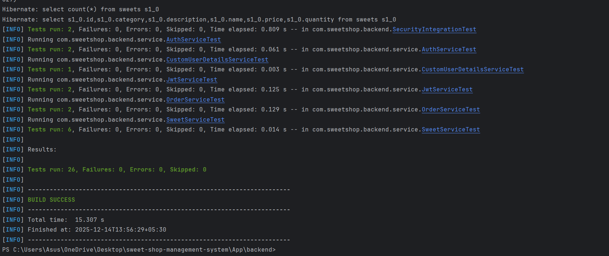
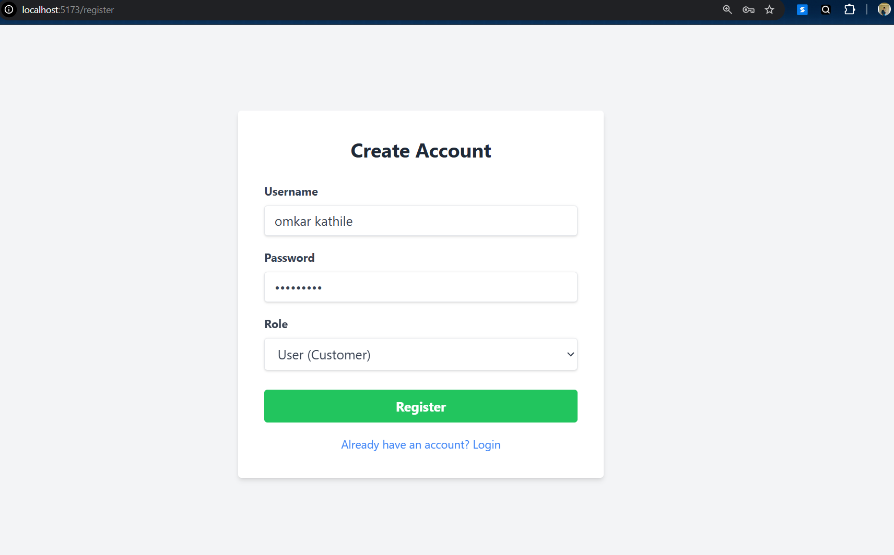
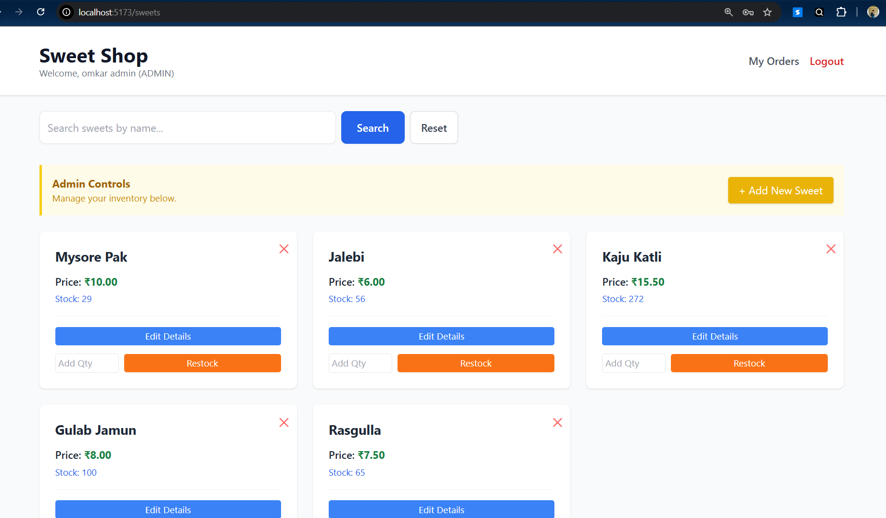
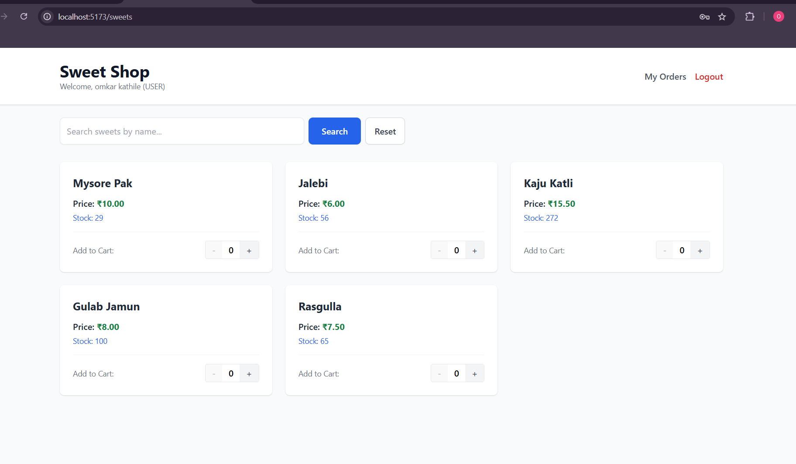
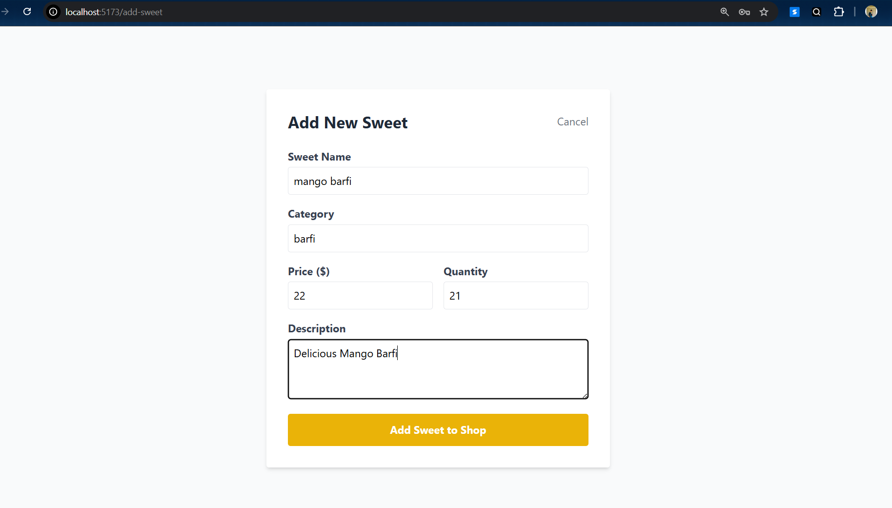
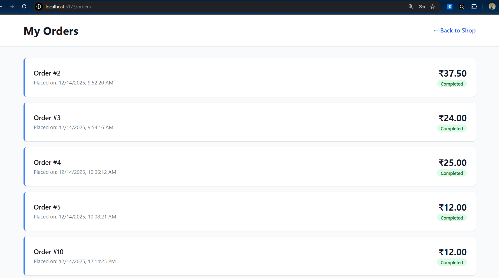
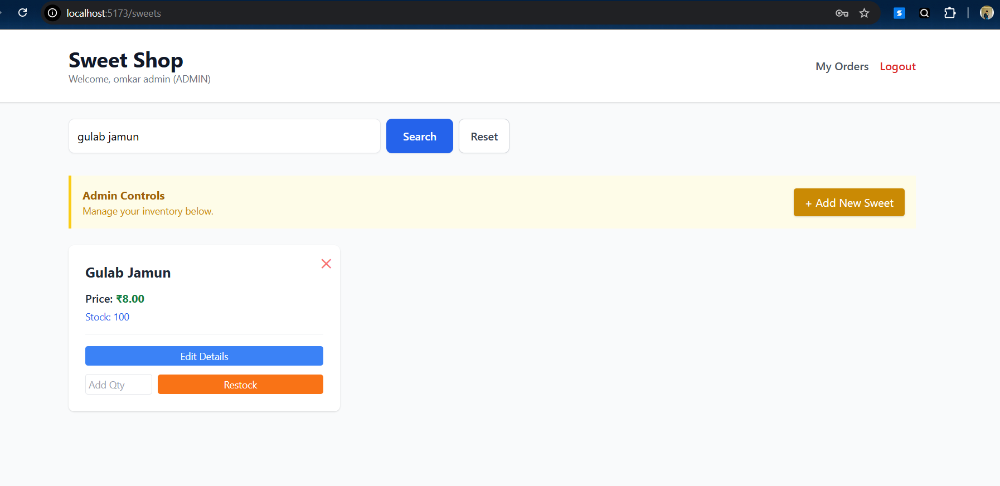
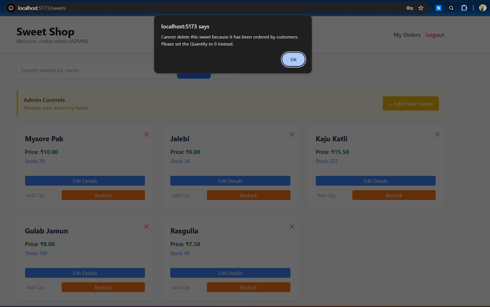
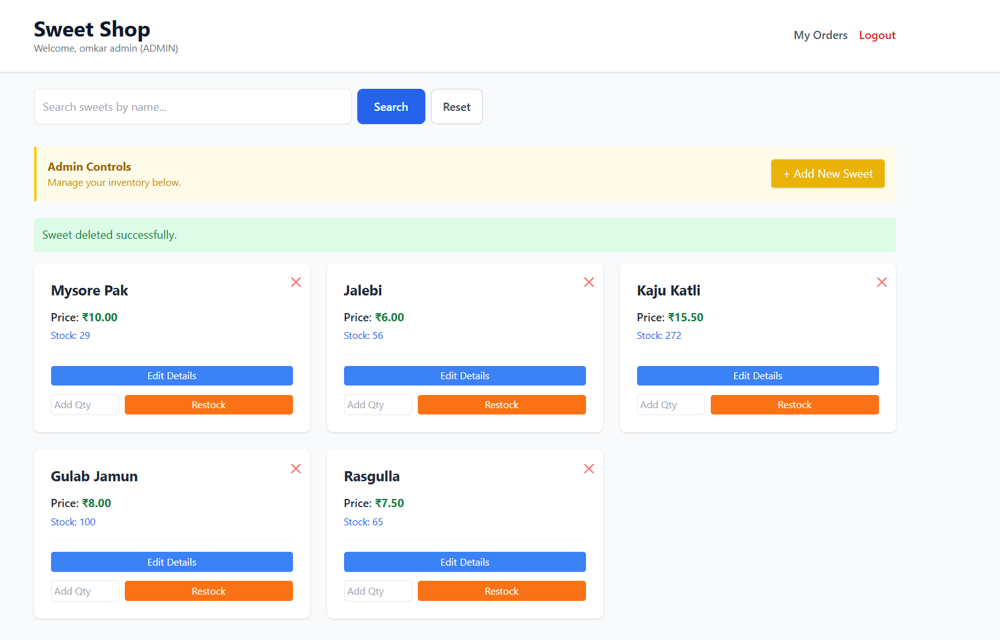

# 🍬 Sweet Shop Management System

**A Full-Stack, TDD-Driven Application for Inventory & Order Management.**

[](https://www.java.com/)
[](https://spring.io/projects/spring-boot)
[](https://reactjs.org/)
[](https://www.postgresql.org/)
[]()

## 📖 Executive Summary
The **Sweet Shop Management System** is a robust Single-Page Application (SPA) designed to bridge the gap between customers buying treats and administrators managing complex inventory.

Unlike simple CRUD apps, this project solves real-world engineering challenges:
* **Data Integrity:** Implementing safe deletion strategies to preserve order history (Foreign Key Constraints).
* **Concurrency:** Handling stock updates atomically.
* **Security:** Role-Based Access Control (RBAC) using JWT.

Built using **Test-Driven Development (TDD)** and **Clean Architecture**, this codebase demonstrates a production-ready mindset.

---

## 🎯 Deliverables & Compliance
This project strictly adheres to the assessment requirements. 
This project was built incrementally using small, meaningful commits.
The commit history reflects feature-by-feature development, bug fixes,
and test-driven iterations.
*Evidence of meeting all core requirements including API, Frontend, TDD, and AI Policy.*

---

## 🛠️ Architecture & Tech Stack

### **Backend (The Core)**
* **Framework:** Java Spring Boot 3.0 (Web, JPA, Security).
* **Database:** PostgreSQL (Relational persistence).
* **Authentication:** Stateless JWT (JSON Web Tokens) with Custom Security Filters.
* **Testing:** JUnit 5, Mockito (Strict TDD approach).

### **Frontend (The Interface)**
* **Framework:** React.js (Vite) + TypeScript.
* **Styling:** Tailwind CSS for a modern, responsive UI.
* **State Management:** React Hooks & Context API.
* **HTTP Client:** Axios with interceptors for token management.

---


---

## 🧠 Engineering Highlights

### 1. Test-Driven Development (TDD) Strategy
I followed the **Red-Green-Refactor** cycle extensively. Tests were written *before* the business logic to ensure robustness.

* **Unit Tests:** Covered Service layer logic (e.g., `calculateTotal`, `preventNegativeStock`).
* **Integration Tests:** Verified Controller endpoints and Security configurations using `MockMvc`.


*Evidence: Comprehensive test suite results confirming system reliability.*

### 2. Solving the "Delete" Constraint (Foreign Key Integrity)
A major challenge was the requirement to "Delete a Sweet."
* **The Problem:** Deleting a product that has already been sold violates Database Referential Integrity (Foreign Key in `order_items`).
* **The Solution:** Instead of a hard crash, I implemented a global `ExceptionHandler`. When a deletion is attempted on a sold item, the backend catches the `DataIntegrityViolationException`, returns a `409 Conflict`, and the frontend guides the Admin to **Zero-Out the Stock** instead. This preserves financial history while removing the item from the sales floor.

---

## 📸 Application Screenshots

A visual tour of the user and administrator experiences.

| | |
|:-------------------------:|:-------------------------:|
| <br><sub>**Secure Login Page**</sub> | <br><sub>**Admin Dashboard**</sub> |
| <br><sub>**Customer Catalog View**</sub> | <br><sub>**Inventory Management**</sub> |
| <br><sub>**Customer Order History**</sub> | <br><sub>**Restock Functionality**</sub> |
| <br><sub>**Admin Reporting**</sub> | <br><sub>**System Overview**</sub> |

---

## 🧪 Testing & Code Quality
The codebase maintains high test coverage. I actively managed dependencies and resolved deprecations (e.g., migrating from `@MockBean` to `@MockitoBean` in Spring Boot 3.4).


*IDE Screenshot: Refactoring test suites to use modern Spring Boot 3.4 annotations, ensuring the application is future-proof.*

---

## 🤖 My AI Usage Statement

*In accordance with the project guidelines, I utilized AI tools to enhance productivity while maintaining full ownership of the architectural decisions.*

| Tool | Usage Strategy | Impact on Workflow |
| :--- | :--- | :--- |
| **Gemini (Google)** | **Architecture & Refactoring** | Used to brainstorm the Entity Relationship Diagram (User -> Order -> OrderItems -> Sweet). Also crucial for refactoring the React `SweetsPage` component to handle both "Admin" and "User" views dynamically. |
| **ChatGPT (OpenAI)** | **Debugging & Security** | Instrumental in configuring the Spring Security Filter Chain. It helped debug specific CORS issues and explained the nuances of handling JWT exceptions. |
| **GitHub Copilot** | **Boilerplate & Speed** | Acted as a pair programmer. It accelerated writing standard CRUD tests and generating repetitive Tailwind CSS classes, allowing me to focus on complex business logic. |

**Reflection:**
AI tools significantly sped up the setup phase. However, they often suggested "Happy Path" code. I had to manually intervene to enforce strict business rules (e.g., "Stock cannot be negative") and fix context loading issues in the Unit Tests.

---

## 🚀 Setup & Installation Instructions

Follow these steps to run the complete system locally.

### 1. Database Setup
Ensure PostgreSQL is installed and running.
```sql
CREATE DATABASE sweetshop_db;
```

## Backend
### 1. Navigate to the backend directory
```
cd backend

```

### 2. Configure Database

### Open src/main/resources/application.properties
```
# PostgreSQL Configuration
spring.datasource.url=jdbc:postgresql://localhost:5432/sweetshop_db
spring.datasource.username=postgres
spring.datasource.password=your_password_here
spring.datasource.driver-class-name=org.postgresql.Driver

# JPA / Hibernate
spring.jpa.database=postgresql
spring.jpa.database-platform=org.hibernate.dialect.PostgreSQLDialect
spring.jpa.hibernate.ddl-auto=update
spring.jpa.show-sql=true
# Update spring.datasource.username and spring.datasource.password
```

### 3. Run the Application

```
./mvnw spring-boot:run
```


## Frontend

### 1. Open a new terminal and navigate to frontend
```
cd frontend
```

### 2. Install Dependencies
```
npm install

```

### 3. Start the Development Server

```
npm run dev

```

